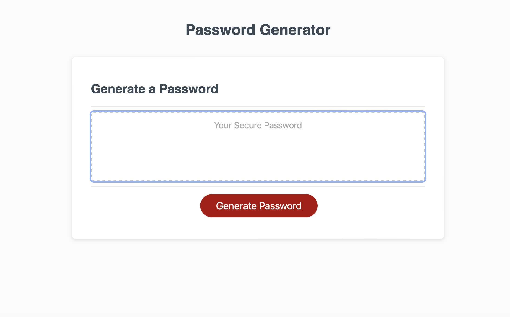

# Password Generator

## Description

Are you still using that old MySpace password from years ago for all of your new accounts? If so, head on over to this password generator application to create new and secure passwords! This webpage develops a random password with the length and types of characters of the users' choice. Through this application, users can make their accounts more secure with new unique passwords. As I developed this project, I learned new skills in JavaScript and gained more experience with GitHub.

## Usage

Link to deployed website: https://kristengould.github.io/JavaScript-Password-Generator/

Begin use of the application by pressing the "Generate Password" button. You will be presented with a series of prompts to determine the length of your password and what types of characters will be included. At the end of the prompts, your new password will be presented in the textbox!

